# 🚀 AI Inference Rate Limiter

<div align="center">


**A distributed rate limiting service designed to control and manage AI inference requests, ensuring fair usage and preventing system overload.**

[Features](#-features) • [Architecture](#-architecture) • [Quick Start](#-getting-started) • [API Reference](#-api-reference) • [Monitoring](#-monitoring--observability)

</div>

---

## 📋 Table of Contents

- [Overview](#-overview)
- [Features](#-features)
- [Architecture](#-architecture)
- [Core Concepts](#-core-concepts)
- [Rate Limiting Algorithm](#-rate-limiting-algorithm)
- [Configuration Model](#-configuration-model)
- [Getting Started](#-getting-started)
- [API Reference](#-api-reference)
- [Deployment Patterns](#-deployment-patterns)
- [Monitoring & Observability](#-monitoring--observability)
- [Evolution Path](#-evolution-path)
- [Advanced Topics](#-advanced-topics)

---

## 🎯 Overview

This project implements a **distributed rate limiting system** specifically tailored for AI inference workloads. It enforces a **Sliding Window Log** policy to control request rates, manage quotas across multiple dimensions, and ensure optimal resource utilization.

```mermaid
graph TB
    Client[👤 Client] -->|HTTP/gRPC Request| Gateway[🌐 API Gateway]
    Gateway -->|AuthN/Z| Auth[🔐 Authentication]
    Auth -->|Check Rate Limit| RateLimiter[⚡ Rate Limiter Service]
    RateLimiter -->|Query State| Redis[(📦 Redis Cluster)]
    RateLimiter -->|Allow/Deny| Decision{✅ Allowed?}
    Decision -->|Yes| Router[🔀 Model Router]
    Decision -->|No| Reject[❌ HTTP 429]
    Router -->|Route Request| ModelServers[🤖 Model Servers / GPU Pool]
    
    style Client fill:#e1f5ff
    style Gateway fill:#fff4e1
    style RateLimiter fill:#ffe1f5
    style Redis fill:#ff6b6b,color:#fff
    style ModelServers fill:#d4edda
```

<div align="center">



</div>

### Key Capabilities

- ✅ **Multi-Scope Rate Limiting** - Enforce limits across user, tenant, API key, model tier, and more
- ✅ **Sliding Window Log** - True time-based windowing for accurate rate limiting
- ✅ **Distributed & Scalable** - Stateless nodes with Redis-backed shared state
- ✅ **AI-Specific Optimizations** - GPU pool protection, global model caps, multi-window protection
- ✅ **Production-Ready** - Comprehensive monitoring, alerts, and graceful degradation

---

## ✨ Features

### 🔹 Core Functional Features

| Feature | Description | Status |
|---------|-------------|--------|
| **Per User + Model** | Default 100 requests/hour per (userId, modelId) pair | ✅ |
| **Multi-Scope Enforcement** | Simultaneous checks across multiple dimensions | ✅ |
| **Configurable Rules** | Dynamic rule resolution with hierarchy | ✅ |
| **Sliding Window Log** | Accurate time-based windowing | ✅ |
| **Metadata-Rich Responses** | Returns limit, remaining, reset time | ✅ |
| **Low-Latency** | Single Redis round-trip via Lua scripts | ✅ |

### 🔹 Safety & Protection Features

| Feature | Description | Status |
|---------|-------------|--------|
| **Global Model Caps** | Cluster-wide RPS limits per model | ✅ |
| **Burst Protection** | Multi-window support (5s, 1m, 1h) | ✅ |
| **Tenant Fairness** | Prevent single-tenant resource saturation | ✅ |
| **QoS Tiers** | Different policies for INTERNAL vs EXTERNAL | ✅ |

### 🔹 Operational Features

| Feature | Description | Status |
|---------|-------------|--------|
| **Hot Reload** | Configuration updates without restart | ✅ |
| **Metrics Export** | Prometheus/StatsD integration | ✅ |
| **Structured Logging** | Request-level decision logs | ✅ |
| **Graceful Degradation** | Configurable fail-open/closed policies | ✅ |

---

## 🏗️ Architecture

### System Architecture Overview

<div align="center">


</div>

### Request Flow Sequence

<div align="center">


</div>

---

## 💡 Core Concepts

### Problem Statement & Interface

We need a **distributed rate limiter** for AI model serving that enforces a **Sliding Window Log** policy.

#### Core API Interface

```typescript
// Core interface
bool allow(
  userId: string,
  modelId: string,
  apiKey?: string,
  tenantId?: string,
  modelTier?: string,
  clientType?: string
)
```

**Returns:** `true` if the request is allowed, `false` if rejected.

#### Exposed Endpoints

**REST API:**
```http
POST /rate-limit/allow
Content-Type: application/json

{
  "userId": "u123",
  "modelId": "gpt4",
  "apiKey": "k789",
  "tenantId": "t456",
  "modelTier": "PREMIUM",
  "clientType": "EXTERNAL"
}
```

**gRPC:**
```protobuf
rpc Allow(AllowRequest) returns (AllowResponse)
```

#### Base Rule

**Default:** 100 requests / hour / (userId, modelId) pair

### Rate Limiting Dimensions

The system supports multiple dimensions for rate limiting:

<div align="center">


</div>

---

## ⚙️ Configuration Model

### Rule Resolution Hierarchy

Rate limits are resolved using a **most-specific to most-generic** hierarchy:

<div align="center">


</div>

### Configuration Table

| Scope | Key Pattern | Window | Default Limit | Example |
|-------|------------|--------|---------------|---------|
| **API_KEY_MODEL** | `apiKey=K1, modelId=GPT4` | 1h | - | 200 req/hour |
| **TENANT_MODEL_TIER** | `tenant=T1, tier=PREMIUM` | 1h | - | 5000 req/hour |
| **TENANT_GLOBAL** | `tenant=T2` | 1h | - | 1000 req/hour |
| **USER_MODEL** | `userId=U1, modelId=GPT4` | 1h | 100 | 100 req/hour |
| **GLOBAL_MODEL** | `modelId=GPT4` | 1h | - | 10000 req/hour |

### Multi-Scope Enforcement

The system enforces **all applicable scopes simultaneously**. All checks must pass for a request to be allowed:

```mermaid
graph LR
    Request[Incoming Request] --> Scope1[USER_MODEL<br/>Limit: 100/h]
    Request --> Scope2[TENANT_TIER<br/>Limit: 5000/h]
    Request --> Scope3[GLOBAL_MODEL<br/>Limit: 10000/h]
    
    Scope1 --> Check1{Count < 100?}
    Scope2 --> Check2{Count < 5000?}
    Scope3 --> Check3{Count < 10000?}
    
    Check1 -->|Yes| Pass1[✓]
    Check1 -->|No| Fail[✗ BLOCKED]
    
    Check2 -->|Yes| Pass2[✓]
    Check2 -->|No| Fail
    
    Check3 -->|Yes| Pass3[✓]
    Check3 -->|No| Fail
    
    Pass1 --> Final{All Pass?}
    Pass2 --> Final
    Pass3 --> Final
    
    Final -->|Yes| Allow[✅ ALLOWED]
    Final -->|No| Fail
    
    style Allow fill:#4CAF50,color:#fff
    style Fail fill:#f44336,color:#fff
```

<div align="center">



</div>

---

## 🔄 Rate Limiting Algorithm

### Sliding Window Log Implementation

The system uses **Redis Sorted Sets (ZSET)** to maintain a log of timestamps per rate-limit key.

#### Redis Key Structure

```
rl:{tenantId}:{scope}:{userId}:{apiKeyId}:{clientType}:{modelTier}:{modelId}
```

**Example:**
```
rl:t123:scope:user_model:user:u456:key:k789:client:EXTERNAL:tier:PREMIUM:model:gpt4
```

#### Algorithm Flow

<div align="center">


</div>

### Lua Script Implementation

```lua
-- KEYS[1] = rate limit key
-- ARGV[1] = windowStart (timestamp in ms)
-- ARGV[2] = now (timestamp in ms)
-- ARGV[3] = limit (max requests)
-- ARGV[4] = ttlSeconds (expiration time)
-- ARGV[5] = member (unique identifier: timestamp:random)

-- Remove entries outside the window
redis.call('ZREMRANGEBYSCORE', KEYS[1], 0, ARGV[1])

-- Count current entries in window
local current = redis.call('ZCARD', KEYS[1])

-- Check if limit exceeded
if current >= tonumber(ARGV[3]) then
  return 0  -- Blocked
end

-- Add new entry
redis.call('ZADD', KEYS[1], ARGV[2], ARGV[5])

-- Set expiration
redis.call('EXPIRE', KEYS[1], ARGV[4])

return 1  -- Allowed
```

### Multi-Scope Atomic Check

For requests that must check multiple scopes, all checks are performed atomically:

<div align="center">


</div>

---

## 🚀 Getting Started

### Prerequisites

- **Redis Cluster** (v6.0+) or Redis with clustering support
- **Node.js** 18+ / **Python** 3.9+ / **Go** 1.20+ (depending on implementation)
- **NTP** synchronized clocks across all nodes

### Quick Start

```bash
# Clone the repository
git clone https://github.com/yourorg/ai-inference-rate-limiter.git
cd ai-inference-rate-limiter

# Install dependencies
npm install  # or pip install -r requirements.txt

# Configure Redis connection
export REDIS_URL="redis://localhost:6379"
export REDIS_CLUSTER_MODE=true

# Start the service
npm start  # or python -m ratelimiter or go run main.go
```

### Configuration Example

```yaml
# config.yaml
redis:
  cluster_mode: true
  endpoints:
    - redis-node-1:6379
    - redis-node-2:6379
    - redis-node-3:6379
  timeout_ms: 20

rate_limits:
  default:
    limit: 100
    window_ms: 3600000  # 1 hour
  
  scopes:
    - type: API_KEY_MODEL
      limit: 200
      window_ms: 3600000
    
    - type: TENANT_MODEL_TIER
      limit: 5000
      window_ms: 3600000
      tier: PREMIUM
```

---

## 📡 API Reference

### REST API

#### Check Rate Limit

```http
POST /rate-limit/allow
Content-Type: application/json

{
  "userId": "user123",
  "modelId": "gpt4",
  "apiKey": "ak_1234567890",
  "tenantId": "tenant_abc",
  "modelTier": "PREMIUM",
  "clientType": "EXTERNAL"
}
```

**Response (Allowed):**
```json
{
  "allowed": true,
  "remaining": 45,
  "resetAt": "2025-12-03T16:00:00Z",
  "effectiveLimit": 100,
  "scopes": [
    {
      "name": "USER_MODEL",
      "limit": 100,
      "current": 55,
      "remaining": 45
    }
  ]
}
```

**Response (Denied):**
```json
{
  "allowed": false,
  "reason": "HIT_TENANT_TIER_MODEL_LIMIT",
  "scopeHit": "TENANT_MODEL_TIER",
  "resetAt": "2025-12-03T16:47:32Z",
  "scopes": [
    {
      "name": "TENANT_MODEL_TIER",
      "limit": 5000,
      "current": 5000,
      "remaining": 0
    }
  ]
}
```

### gRPC API

```protobuf
service RateLimiterService {
  rpc Allow(AllowRequest) returns (AllowResponse);
}

message AllowRequest {
  string userId = 1;
  string modelId = 2;
  optional string apiKey = 3;
  optional string tenantId = 4;
  optional string modelTier = 5;
  optional string clientType = 6;
}

message AllowResponse {
  bool allowed = 1;
  int32 remaining = 2;
  string resetAt = 3;
  string scopeHit = 4;
  repeated ScopeStatus scopes = 5;
}
```

---

## 🏭 Deployment Patterns

### Pattern 1: Sidecar Deployment

<div align="center">


**Pros:**
- ✅ Low latency (localhost communication)
- ✅ Simple network topology
- ✅ Scales with gateway pods

**Cons:**
- ❌ More complex deployment (sidecar per pod)
- ❌ Resource overhead

</div>

### Pattern 2: Centralized Service

<div align="center">


**Pros:**
- ✅ Single deployment to manage
- ✅ Easy versioning and rollouts
- ✅ Better resource utilization

**Cons:**
- ❌ Extra network hop (still sub-ms in same VPC)

</div>

---

## 📊 Monitoring & Observability

### Metrics Dashboard Overview

<div align="center">


</div>

### Key Metrics

#### Request Metrics

| Metric | Type | Description | Labels |
|--------|------|-------------|--------|
| `rate_limiter_requests_total` | Counter | Total allow/deny decisions | `result`, `scope`, `model_id`, `tenant_id` |
| `rate_limiter_latency_seconds` | Histogram | Allow() operation latency | `operation` |
| `rate_limiter_usage_ratio` | Gauge | Current usage / limit ratio | `scope`, `model_id`, `tenant_id` |

#### Redis Metrics

| Metric | Type | Description | Labels |
|--------|------|-------------|--------|
| `rate_limiter_redis_errors_total` | Counter | Redis operation errors | `type`, `operation` |
| `rate_limiter_redis_latency_seconds` | Histogram | Redis operation latency | `operation` |
| `rate_limiter_redis_calls_total` | Counter | Total Redis calls | `operation` |

#### System Health Metrics

| Metric | Type | Description | Labels |
|--------|------|-------------|--------|
| `rate_limiter_config_version` | Gauge | Current config version | `source` |
| `rate_limiter_fallback_total` | Counter | Fallback mode activations | `mode` |
| `rate_limiter_config_load_failures_total` | Counter | Config reload failures | - |

### Sample Dashboard Panels

<div align="center">


</div>

### Structured Logging Example

```json
{
  "timestamp": "2025-12-03T15:00:01Z",
  "level": "INFO",
  "requestId": "req-uuid-1234",
  "userId": "u123",
  "tenantId": "t1",
  "apiKeyId": "k1",
  "modelId": "gpt4",
  "modelTier": "PREMIUM",
  "clientType": "EXTERNAL",
  "scopes": [
    {
      "name": "USER_MODEL",
      "limit": 100,
      "count": 55,
      "remaining": 45
    },
    {
      "name": "TENANT_TIER_MODEL",
      "limit": 5000,
      "count": 203,
      "remaining": 4797
    }
  ],
  "allowed": true,
  "remaining": 45,
  "windowResetAt": "2025-12-03T15:47:32Z",
  "latencyMs": 3.2
}
```

### Alert Rules

<div align="center">


</div>

---

## 🔄 Evolution Path

### From In-Memory to Distributed

This section outlines the evolution from a simple in-memory implementation to a production-ready distributed system.

<div align="center">


</div>

### Step-by-Step Evolution

#### Step 1: Abstract Storage Layer

<div align="center">


</div>

#### Step 2: Introduce Redis Backend

```typescript
// Pseudo-code evolution

// Phase 1: In-Memory
class InMemoryStore implements SlidingWindowStore {
  private state = new Map<string, SortedSet<number>>();
  
  tryAdd(key: string, nowMs: number, limit: number): boolean {
    const windowStart = nowMs - WINDOW_MS;
    const set = this.state.get(key) || new SortedSet();
    
    // Prune old entries
    while (set.size > 0 && set.first() < windowStart) {
      set.removeFirst();
    }
    
    if (set.size >= limit) return false;
    set.add(nowMs);
    return true;
  }
}

// Phase 2: Redis-backed
class RedisStore implements SlidingWindowStore {
  constructor(private redis: RedisClient) {
    this.scriptSha = redis.scriptLoad(SLIDING_WINDOW_LUA);
  }
  
  tryAdd(key: string, nowMs: number, limit: number): boolean {
    const result = redis.evalSha(
      this.scriptSha,
      [key],
      [windowStart, nowMs, limit, ttl, member]
    );
    return result === 1;
  }
}
```

#### Step 3: Handle Clock Skew

<div align="center">


</div>

#### Step 4: Retry & Failure Handling

<div align="center">


</div>

---

## 🎓 Advanced Topics

### Multi-Window Protection

For comprehensive protection, multiple time windows can be enforced simultaneously:

```mermaid
graph TB
    Request[Incoming Request] --> Win5s[5 Second Window<br/>Burst Control]
    Request --> Win1m[1 Minute Window<br/>Short-term Load]
    Request --> Win1h[1 Hour Window<br/>Fairness & Billing]
    
    Win5s --> Check5s{Count < Limit?}
    Win1m --> Check1m{Count < Limit?}
    Win1h --> Check1h{Count < Limit?}
    
    Check5s -->|Yes| Pass5s[✓]
    Check5s -->|No| Block[BLOCKED<br/>Burst Exceeded]
    
    Check1m -->|Yes| Pass1m[✓]
    Check1m -->|No| Block
    
    Check1h -->|Yes| Pass1h[✓]
    Check1h -->|No| Block
    
    Pass5s --> Final{All Pass?}
    Pass1m --> Final
    Pass1h --> Final
    
    Final -->|Yes| Allow[✅ ALLOWED]
    Final -->|No| Block
    
    style Win5s fill:#E91E63,color:#fff
    style Win1m fill:#2196F3,color:#fff
    style Win1h fill:#4CAF50,color:#fff
    style Allow fill:#4CAF50,color:#fff
    style Block fill:#f44336,color:#fff
```

<div align="center">



</div>

### QoS Tiers: Internal vs External

```mermaid
graph LR
    subgraph "Client Types"
        Internal[🔵 INTERNAL<br/>Higher Limits<br/>Fail-Open Policy]
        External[🔴 EXTERNAL<br/>Stricter Limits<br/>Fail-Closed Policy]
        Partner[🟡 PARTNER<br/>Medium Limits<br/>Fail-Closed Policy]
    end
    
    subgraph "Rate Limits Example"
        I1[INTERNAL: 1000/h]
        E1[EXTERNAL: 100/h]
        P1[PARTNER: 500/h]
    end
    
    Internal --> I1
    External --> E1
    Partner --> P1
    
    style Internal fill:#2196F3,color:#fff
    style External fill:#f44336,color:#fff
    style Partner fill:#FF9800,color:#fff
```

<div align="center">



</div>

### Cost/Token-Aware Limits (Future Extension)

<div align="center">


</div>

---

## 📝 Summary

This AI Inference Rate Limiter provides:

- ✅ **Accurate Rate Limiting** - Sliding Window Log algorithm for precise control
- ✅ **Multi-Dimensional** - User, tenant, API key, model, tier, and client type
- ✅ **Distributed & Scalable** - Stateless nodes with Redis-backed shared state
- ✅ **Production-Ready** - Comprehensive monitoring, alerts, and graceful degradation
- ✅ **AI-Optimized** - GPU pool protection, global caps, multi-window support

### Quick Reference

| Aspect | Implementation |
|--------|----------------|
| **Algorithm** | Sliding Window Log |
| **Storage** | Redis Sorted Sets (ZSET) |
| **Atomicity** | Lua scripts for atomic operations |
| **Scalability** | Stateless nodes, Redis Cluster |
| **Latency** | Single Redis round-trip |
| **Accuracy** | Time-based, not bucket-based |

---

<div align="center">

**Built with ❤️ for AI Inference Workloads**

[Documentation](#) • [API Reference](#api-reference) • [Contributing](#) • [License](#)

</div>
